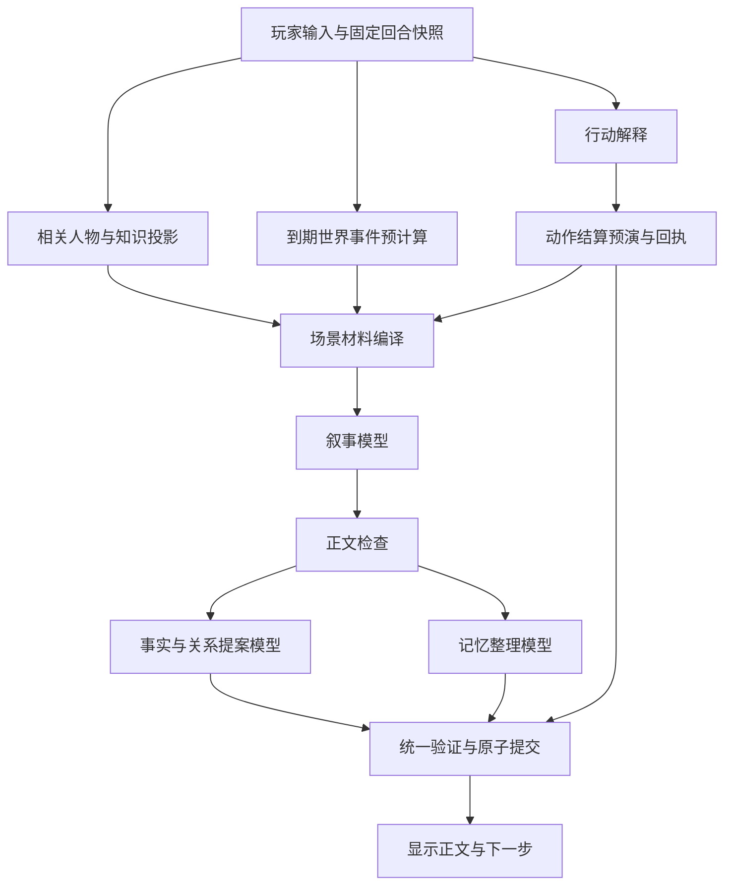

# 六朝回合模块解耦方案

日期：2026-10-01。用户要求将功能归位、独立成模块，通过解耦与多模型并发改善速度。成熟度：架构提案；尚未实施运行时迁移，未改变模型配置。依据：Run6报告／ctx.log，以及当前`AIBidirectionalSystem.ts`、`promptAssembler.ts`、`naturalIntentRouter.ts`、`canonGuard.ts`与关系投影代码。

## 问题与目标

Run6一份真实请求序列化后114317字符；主系统消息97438字符，游戏状态所在段58507字符。模型同时接收正典、关系、世界调度、通用判定与状态修改规则。职责混合与指令冲突是需验证的根因；上下文长度、上游推理和输出量也需分别测量。

目标是明确每个模块的输入、输出、写入权限与失败范围，让叙事模型只承担本轮演出。模块隔离指的是消除隐式共享写入与职责重叠，模块仍通过明确合同协作。并发任务数量不等于提速，需测关键路径、上游并发限制和成本。

## 功能归位

| 模块 | 职责与输出 | 执行方式／边界 | 现有代码归属 |
| --- | --- | --- | --- |
| 回合协调器 | 固定角色／槽位／状态版本／turnId；调度、取消、记录阶段耗时 | 代码；不写剧情，不裁定正典 | MainGamePanel + processPlayerAction + qingyuTurnLongRequests |
| 行动解释 | 将玩家输入解释成当前合法动作或自由行动，返回原文证据与置信度 | 按钮／确定性匹配优先；必要时小模型；不代替玩家承诺、不结算 | naturalIntentRouter + judgementPreflight |
| 状态结算 | 根据已确认动作计算事件、判定、物品、位置等变化，产生带来源回执 | 代码为唯一权威；保留既有事务、幂等与拒赌合同 | runtime + fixedInventoryContracts + judgement + processGmResponse |
| 人物／知识投影 | 选当前相关人物、实际关系、已知事实、当前阶段和必要规则 | 代码投影；不得全量发送后台秘密；不让模型推断受保护字段 | storyContext + canonGuard + relationships |
| 世界调度 | 判断到期事件、NPC行动、外部压力，输出本轮可见世界回执 | 已有引擎规则优先；未知方案可独立模型提案，验证后才成为事实 | divergenceControl + world actor／simulation + scheduled event |
| 场景材料编译 | 聚合本轮输入、承接、行动结果、人物投影、可见世界事件 | 代码；按场景选规则，去重并记录分段大小 | narrativePromptState + promptAssembler + storyContext |
| 叙事生成 | 写本轮正文、人物回应和下一步可见选择 | 专用叙事模型；输出无任意状态写入指令；不重复裁定已结算结果 | generate + Legacy／Fast narrative adapters |
| 事实／关系提案 | 从已接受正文提取有证据的关系变化、承诺、见闻等 | 小模型可用；产生提案及证据跨度，不能将未经结算的描写变成物品／能力／生死真值 | 既有commands／reconcile相关逻辑逐步归位 |
| 记忆整理 | 对已接受正文形成记忆摘要与检索索引 | 与事实提案并行；不自主确认关系、不改年龄等静态正典 | memory summary／RAG |
| 验证与提交 | 校验模块结果、写入权限、来源、冲突、版本与取消状态，统一提交 | 代码；模型只提案，禁止各模型直接写store或save | canonGuard + command validation + processGmResponse事务 |

事实抽取、关系语义和摘要含语言判断，不冒称全部可以确定性计算；代码负责权限、证据验证及提交。角色身份变化必须有明确确认，不由好感推导。

## 依赖与并发

- 行动解释、人物投影与不依赖本次行动的到期事件可并行。若世界结果依赖动作消耗的时间或位置，先得到动作预演再计算；不能提前当成事实。
- 正文依赖当前行动结果与知识边界，必须等待它们，不能与其盲目并发。
- 正文接受后，事实／关系提案与记忆整理可用不同模型并行；两者从同一不可变正文读取，不互相依赖。
- 会影响下一回合真值的结果必须在统一提交前完成；向量索引等派生工作可后台执行，下一回合不得依赖尚未完成的索引。后台失败不回滚已提交事实。
- 不必每轮调用每个模型：结构化合同已经完整给出变化时跳过重复抽取；纯叙事且无新关系事实时只整理必要记忆。

## 接口与写入合同

所有结果携带`turnId / characterId / slotId / baseRevision / source / status`。模型结果另带证据文本位置、允许的字段与提案值。模块输入是不可变快照，各自只收到完成职责所需的字段。

统一提交器检查当前档与版本仍一致、该回合未取消、动作仍新鲜，之后处理回执和合法提案。代码回执拥有确定性结果；模型无权覆盖。两个模型对同一字段冲突时拒绝冲突提案并记录，不以最后返回者获胜。迟到结果属于旧回合，丢弃，不清新回合忙碌状态。

关键任务失败时保持旧状态与所属档草稿，告知具体失败阶段。只重试失败模块，复用同版本、同输入且已验证的中间结果；切档／版本改变后不得复用。不能通过兜底跳过签约确认或替玩家决定关系。

## 渐进实施顺序

1. 先建立分段上下文／阶段耗时记录，明确回合快照和模块结果接口；复用现有事务与取消机制。修复草稿跨档归属。
2. 将当前世界、人物知识与关系投影编译为单份本轮材料，建立专用叙事输出接口。保留旧路径供隔离对照；不直接删除保护规则或重写结算。
3. 将事实／关系提案与记忆整理从主叙事prompt中移出；验证写入边界，再启用并发调度。模型选择按各任务准确率与耗时决定，不擅改用户配置。
4. 先选白湖谈期限和03b关系交谈两类场景做相同初始快照、相同行动的重复对照，覆盖成功、失败、取消、切档、迟到、关系拒绝及数据冲突；再扩大连续路线。

验收同时看完成率、点击到可继续操作的P50／P95、每阶段耗时、输入／输出／推理token（上游口径可靠时）、成本、重复结算与剧情一致性。不能只报单模型响应速度，也不能拿缩短超时制造出的失败作为提速。

跨组接口：系统策划负责调度、权限与状态合同；剧情／事件策划提供本轮演出边界、人物关系确认样本与承接样本。正典保护字段与既有路线仍遵循裁定簿；本提案不授权改正典或宣称性能问题已解决。

## 2026-10-01 最小验证补充

用户进一步明确：复用游戏已有按功能指定的模型，模块可串行／并行／后台异步，不要求三个模型每轮同时运行。已实现[隔离Demo](MODULE-DEMO-RESULT-2026-10-01.md)：本地代码预演合同→Jev正文→验证与模拟提交→MiniMax记忆／DeepSeek优化后台并行→验证汇总。未另起模型分配体系，正式优化关闭状态不变。原型仅验证上述纵切，不代表本文所有模块迁移或主游戏性能验收；下一步先补通用事实投影、异步失败恢复和下一轮读取一致性。
